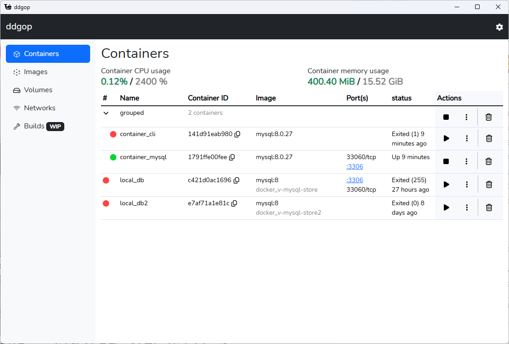

# ddgop



## dev

- `go install github.com/wailsapp/wails/v2/cmd/wails@latest`
- `wails init -n ddgop -t react-ts`
- `wails dev`

## WSL/~~VirtualBox~~

- Execute only the required steps:
    1. `vi /etc/docker/daemon.json`

        ```json
        {
            "hosts": ["unix:///var/run/docker.sock", "tcp://0.0.0.0:2375"]
        }
        ```

    2. `chown root:root /etc/docker/daemon.json`
    3. `chmod 644 /etc/docker/daemon.json`
        1. If needed: `systemctl daemon-reload`
    4. `systemctl edit docker`
        1. or 
        2. `mkdir /etc/systemd/system/docker.service.d/`
        3. `vi /etc/systemd/system/docker.service.d/override.conf`

            ```conf
            [Service]
            ExecStart=
            ExecStart=/usr/bin/dockerd --containerd=/run/containerd/containerd.sock
            ```

    5. `systemctl restart docker`
        1. If needed: `chmod 666 /var/run/docker.sock`
    6. `systemctl status docker`
        - old: `/usr/bin/dockerd -H fd:// --containerd=/run/containerd/containerd.sock`
        - new: `/usr/bin/dockerd --containerd=/run/containerd/containerd.sock`
    7. `firewall-cmd --add-port 2375/tcp --permanent --zone=public`
    8. `firewall-cmd --reload`
